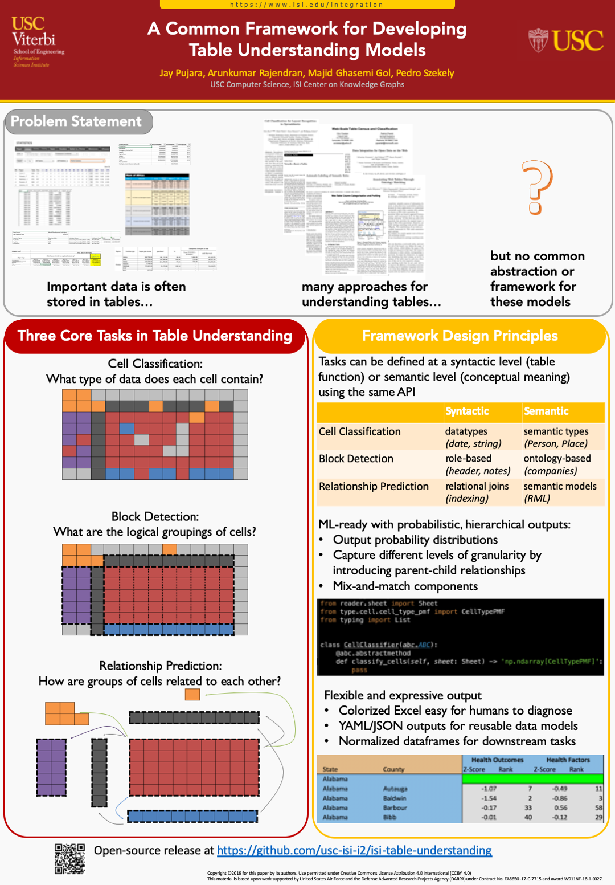

# A Framework for Table Understanding
This repository holds the core classes for our framework for table understanding. These classes are currently available in the development (dev) branch as we work to improve documentation and add more useful examples. Please find details about our framework and implementation below.
[Paper at ISWC 2019](readme/pujara_iswc19.pdf)

